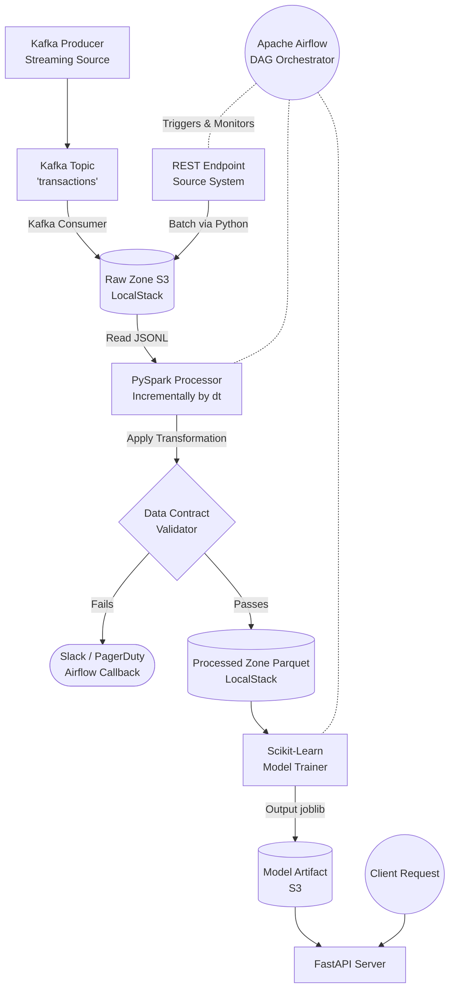

# 🚀 Enterprise Data Pipeline Architecture: Lambda + AI MLOps

[](https://github.com/Kush-Bhatt-30/data-pipeline-ai/actions)
[](https://www.python.org/downloads/release/python-3110/)
[](https://mypy.readthedocs.io/en/stable/)
[](https://github.com/astral-sh/ruff)
[](https://docs.pytest.org/)

An end-to-end, production-ready data engineering platform executing a full **Lambda Architecture**. This repository bridges the gap between proof-of-concept AI pipelines and highly resilient, Fortune 500-level data systems.

## 🌟 Enterprise Features Integrated

- **Infrastructure as Code (IaC):** Utilizes Terraform to programmatically define and audit the S3 data lakes over LocalStack.
- **Fail-Fast Data Contracts:** PySpark validation layers dynamically reject bad data (null amounts, invalid currencies) *before* it pollutes the data warehouse.
- **Strict Developer Experience (DX):** Code simply cannot be merged unless it passes the `.pre-commit` pipeline enforcing Type Safety (`mypy`) and lint checks (`ruff`).
- **Comprehensive CI/CD:** GitHub Actions workflow automatically benchmarks test coverage, code quality, and security vulnerability scans (`bandit`) natively.
- **Observability:** JSON structured logging feeds natively into DataDog/ELK pipelines with `on_failure_callback` Airflow alerts simulating immediate PagerDuty dispatch.

---

## 🏗️ Technical Architecture Diagram



---

## 🛠️ Technology Stack
| Category | Technology | Purpose |
|----------|-------------|---------|
| **Ingestion** | `Kafka` & `Python` | Real-time streaming and REST batch ingestion logic. |
| **Storage** | `LocalStack (S3)` | Enterprise-grade cloud object storage simulation. |
| **Processing** | `PySpark` | Horizontally scalable incremental big-data transformations. |
| **Orchestration** | `Apache Airflow` | Task dependency management and alerting. |
| **ML & Serving** | `Scikit-Learn` & `FastAPI` | Training ML Models & High-concurrency caching inference engine. |
| **IaC & DX** | `Terraform`, `Ruff`, `Mypy` | Cloud infrastructure deployment, strict static typing, and linting. |

---

## 🚀 Getting Started

### 1. Provision Infrastructure
Start the core systems (Kafka, Airflow, FastAPI, Spark) using Docker:

```bash
docker compose -f docker/docker-compose.yml up --build
```
*Wait for `airflow-init` to complete before accessing `http://localhost:8081`.*

### 2. Apply Terraform Definitions (Optional mock)
Simulate enterprise infrastructure setup by hooking Terraform into LocalStack:
```bash
cd terraform
terraform init
terraform apply
```

### 3. Run The Pipeline (Airflow)
1. Open the Airflow UI: `http://localhost:8081` *(user: airflow, pass: airflow)*
2. Find the DAG `data_pipeline_ai_lambda`.
3. Unpause the DAG and trigger it manually.

Watch as Airflow bootstraps storage paths, generates synthetic REST data, processes it through the PySpark **Data Contract Engine**, triggers model training, and generates batch predictions.

---

## 🛡️ The "Data Contract" Engine

The traditional pipeline breaks downstream systems when the API source abruptly changes schema. We resolve this by extending PySpark logic:

```python
        (
            DataContractValidator(clean_df)
            .expect_table_row_count_to_be_between(min_value=1)
            .expect_column_values_to_not_be_null("amount")
            .expect_column_values_to_be_in_set("currency", ["USD", "EUR", "GBP", "JPY"])
            .expect_column_values_to_be_between("amount", min_v=0.01, max_v=999999.0)
            .validate()
        )
```
If constraints violate on incoming payload, the pipeline fails early organically, ensuring clean, downstream Data Warehouse compliance.

---

## 👨‍💻 Developer Workflow

Before raising a PR, your code must pass strict constraints:
```bash
# 1. Install Dev Tools
pip install -r requirements-dev.txt

# 2. Setup git hooks (Runs Ruff & Mypy automatically on git commit)
pre-commit install

# 3. Manually execute test suite locally
pytest tests/ --cov=./ 
```

**Developed as an architectural demonstration mapping conceptual data pipelines into Fortune-500 production rigor.**
